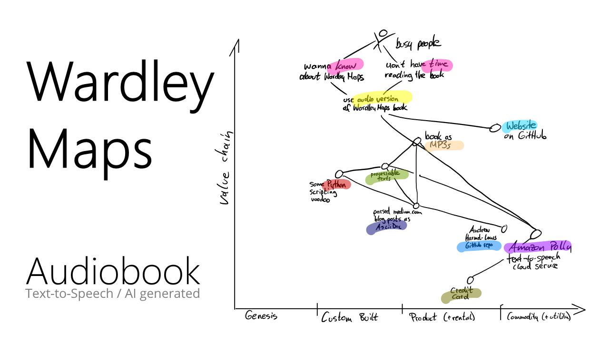

Here you can download and listen to the (synthetically generated) audio version of [Simon Wardley](https://twitter.com/swardley)'s book ["Wardley Maps &ndash; Topographical intelligence in business"](https://medium.com/wardleymaps).

_If you want to find out more about this website (e. g. what headphones, housework and the constant desire to learn have to do with it), check out the [About](./about/) section. Plus: there is now also a [German version](https://feststelltaste.github.io/wardley-maps-hoerbuch/) of the book._

# Complete MP3 file

Here you can find one "big" MP3 file that contains the complete content of the book. 

**Female voice**  

* <b><a href="https://github.com/feststelltaste/wardley-maps-audiobook/releases/download/v1.1/Simon_Wardley_-_Wardley_Maps_-_Topographical_intelligence_in_business_v1.0-female.mp3">Simon Wardley: Wardley Maps - Topographical intelligence in business (301 MB)</a></b>

**Male voice** 

* <b><a href="https://github.com/feststelltaste/wardley-maps-audiobook/releases/download/v1.0/Simon_Wardley_-_Wardley_Maps_-_Topographical_intelligence_in_business_v1.0.mp3">Simon Wardley: Wardley Maps - Topographical intelligence in business (306 MB)</a></b>

# Single MP3 files (1 file per section)

Here you can find one MP3 file for each section of the book for direct listening. You can download these files in one package:

**Female voice**  
* [**.tar.gz file (282 MB)**](https://github.com/feststelltaste/wardley-maps-audiobook/releases/download/v0.1-female/wardley-maps-audiobook-v0.1-female.tar.gz)
* [**.zip file (282 MB)**](https://github.com/feststelltaste/wardley-maps-audiobook/releases/download/v0.1-female/wardley-maps-audiobook-v0.1-female.zip)

**Male voice**  
* [**.tar.gz file (285 MB)**](https://github.com/feststelltaste/wardley-maps-audiobook/releases/download/v1.0/wardley-maps-audiobook-v1.0.tar.gz)
* [**.zip file (285 MB)**](https://github.com/feststelltaste/wardley-maps-audiobook/releases/download/v1.0/wardley-maps-audiobook-v1.0.zip)

Or you can directly listen to a section by clicking on a type of voice you prefer:





{{title}} 

<small>
<a class="female" style="color:grey" href="https://wardley-maps-audiobook.s3.eu-central-1.amazonaws.com{{ female_path | escape }}">female voice</a>
&nbsp;
<a class="male" style="color:grey"  href="https://wardley-maps-audiobook.s3.eu-central-1.amazonaws.com{{ mp3.path | escape }}">male voice</a></small>





&nbsp;
<small>
<a style="color:grey" href="{{ site.baseurl }}{{ mp3_ben.path | escape }}">Ben</a>
</small>







# Human Narrators
In addition to the generated version of the audiobook by Amazon Polly, we're happy to have some voices from the Wardley Mapping community!

**Ben Mosior**  
Principal, Hired Thought <a href="https://twitter.com/HiredThought"><i class="fa fa-twitter"></i></a>

<table style="border:none;">
 <tr>
  <td style="border:none;" width="150px"></td>
  <td style="border:none;" >
  Ben is your friendly methodology whisperer, developing innovative new methods into everyday tools and facilitating learning experiences for teams and communities. Through Hired Thought, Ben shares decision-making and sensemaking approaches oriented around collective knowledge creation. To democratize access to strategic thinking methods, he operates <a href="https://learnwardleymapping.com/">LearnWardleyMapping.com</a> and runs regular events to inform and uplift new practitioners. Ben's goal in work and life is to do his part to enable purposeful systems to flourish. He podcasts for joy and teaches for hope.
  </td>
 </tr>
</table>

# More information

Here you can find some further awesome resources about Wardley Maps:
- <http://list.wardleymaps.com> - Useful Wardley mapping resources.
- <https://learnwardleymapping.com/> - An excellent introduction to Wardley Maps.

# Statistics
Here are some statistics from the underlying [GitHub repository](https://github.com/feststelltaste/wardley-maps-audiobook/):


